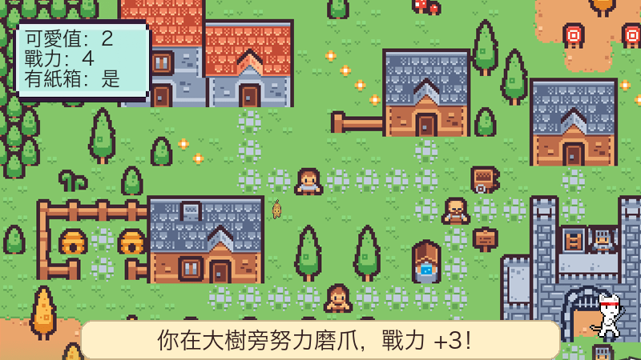
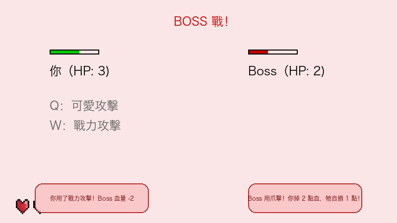

# Stray Cat Adventure 🐾

A 2D top-down RPG built with **Python** and **pygame**. You play a stray cat exploring a village: charm students, beg for food, dodge the rain, and train your claws, then fight the local boss cat to become the ruler of the neighborhood.

Final project for the **Object-Oriented Programming** course at **National Yang Ming Chiao Tung University (NYCU)**, 2025. Designed and built solo by [@0u88](https://github.com/0u88), covering game design, programming, and asset integration.

> **Note:** All in-game text is in Traditional Chinese.

| Exploring the village | Boss battle |
|---|---|
|  |  |

## Gameplay

Walk into different areas of the map to trigger missions. Each mission changes your **Cuteness** and **Power**, and those stats decide how the final battle goes.

| Mission | Effect |
|---|---|
| **Beg for petting**: charm a student | Cuteness +1 |
| **Beg for food**: meow at the library exit | Power +1 (only if Cuteness ≥ 1) |
| **Hide from the rain**: rain starts 20 s in; reach the shelter within 5 s | Power −1 if you get wet |
| **Granny's feast**: she feeds you way too much | Power −1 |
| **Claw training**: scratch the big tree | Power +3 |
| **Find a box**: build a nest for the night | Requires Power ≥ 1 |
| **Boss battle**: challenge the boss cat | Your HP = your Power |

### Boss battle

A turn-based fight. Every attack you make is followed by a random counterattack from the boss.

- **Cute attack (`Q`)**: costs 1 Cuteness, deals 1 damage
- **Power attack (`W`)**: costs 1 Power, deals 2 damage
- The boss randomly uses a normal hit, a claw strike (hurts itself too), a scare (you lose Cuteness), or a bluff that misses

Defeat the boss to earn the title of **Ruler of the Territory**!

## Controls

| Key | Action |
|---|---|
| `↑` `↓` `←` `→` | Move |
| `Space` | Challenge the boss / continue after a battle |
| `Q` | Cute attack |
| `W` | Power attack |

## Features

- **Sprite animation**: 4-direction walking animation for the cat and an animated boss
- **Walkable-area mask**: collision uses a grayscale mask image of the map, so the cat stays on paths
- **Mission zones**: data-driven trigger areas, each bound to its own effect callback
- **Timed weather event**: the screen darkens with a flashing warning when it starts to rain
- **Message system**: rounded dialog boxes that fade out, with a separate style for battles

## Design

Each game concept is its own class:

| Class | File | Responsibility |
|---|---|---|
| `Game` | `game.py` | Main loop, scene switching (map ↔ battle), mission effects, HUD |
| `Cat` | `cat.py` | Player: movement, walkable-mask collision, animation, attacks |
| `BossCat` | `boss.py` | Boss: animation, HP, random attack patterns |
| `MissionZone` | `mission.py` | A trigger rectangle that calls its effect function on collision |
| `MessageManager` | `message.py` | Queue of timed, fading dialog messages |

`MissionZone` takes the effect as a callback (for example `Game.scratch_training`), so a new mission only needs a new method and one line in the mission list. The zone class itself stays unchanged.

## Project Structure

```
.
├── main.py              # Entry point
├── game.py              # Game loop and scene control
├── cat.py               # Player character
├── boss.py              # Boss character
├── mission.py           # Mission trigger zones
├── message.py           # Dialog/message boxes
├── assets/
│   ├── bg/              # Map background and walkable mask
│   ├── boss/            # Boss animation frames
│   ├── cat/             # Cat walking frames (up/down/left/right)
│   └── ui/              # HUD elements
├── docs/screenshots/    # README images
└── requirements.txt
```

## Getting Started

**Requirements:** Python 3.8+ (pygame 2.6+ is needed on Python 3.13)

```bash
git clone https://github.com/0u88/oop-2025-proj-group21.git
cd oop-2025-proj-group21
pip install -r requirements.txt
python main.py
```

Run the game from the repository root. Asset paths are relative to it.

## Known Issues

- The UI font is hard-coded to `HiraginoSansGB`, which is only available on macOS. On Windows or Linux the Chinese text may render as empty boxes.
